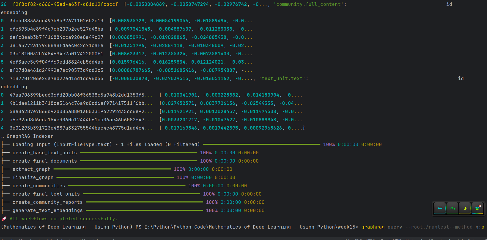
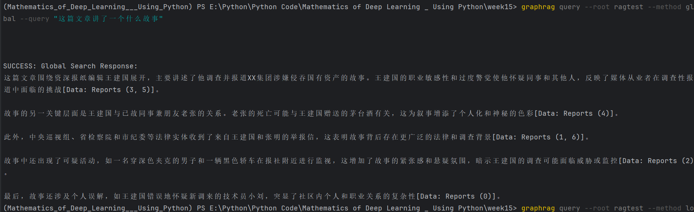
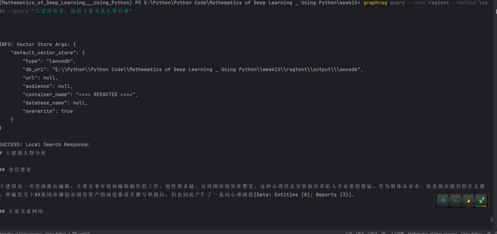

## 运行结果：
```json
# 1、安装 graphrag
pip install graphrag
# 2、创建文件夹
mkdir -p ./ragtest/input
# 3、将需要分析的文件放入input文件夹
# 4、初始化工作区
graphrag init --root ./ragtes
# 5、运行索引流程
graphrag index --root ./ragtest
```


## 全局提问：
```json
graphrag query--root./ragtest--method global "这篇文章讲了一个什么故事"
```

## 局部提问：
```json
graphrag query --root ragtest --method local --query "王建国是谁，他的主要关系人都有谁" 
```

# 王建国人物分析

## 身份背景

王建国是一名资深报社编辑，主要从事审阅和编辑稿件的工作。他性格多疑，对周围环境异常警觉，这种心理状态导致他经常陷入不必要的猜疑。作为媒体从业者，他表现出强烈的正义感 ，曾编发关于XX集团涉嫌侵吞国有资产的深度报道并撰写举报信，但也因此产生了一系列心理困扰[Data: Entities (0); Reports (3)]。

## 主要关系网络

### 职业关系

1. **报社同事**：
   - **张明/老张**：已故同事和朋友，生前曾因精神问题住院治疗，期间撰写大量举报信。张明曾提醒王建国关于某篇报道的潜在风险，他的意外死亡成为王建国心理困扰的重要因素[Data: Entities (1,14); Relationships (0,14,18)]。
   - **老李**：报社清洁工，被王建国怀疑可能被他人收买[Data: Entities (7); Relationships (8)]。
   - **报社总编**：曾试图联系王建国，可能与其举报信或XX集团案件有关[Data: Entities (24); Relationships (30)]。

2. **调查对象**：
   - **XX集团**：王建国编发了关于该集团涉嫌侵吞国有资产的报道，并举报其违法行为[Data: Entities (2,23); Relationships (1,29)]。

### 执法与监督机构

1. **陈警官**：派出所警官，负责处理王建国的举报信，并向其解释张明的情况[Data: Entities (16); Relationships (20)]。
2. **市纪委/省检察院/中央巡视组**：王建国和张明举报信的接收单位[Data: Entities (17,18,19); Relationships (21,22,25,27,28)]。

### 其他重要关系

1. **小刘/刘明**：新调来的技术员，被王建国误认为是可疑人物并跟踪，实际上是在谈恋爱[Data: Entities (12,13); Relationships (13,15,16,17)]。
2. **深色夹克男人**：从黑色轿车下来的神秘人物，王建国怀疑其参与监视活动[Data: Entities (8); Relationships (9,11,12)]。

## 心理状态分析

王建国的职业敏感性和过度警觉导致了一系列误解和猜疑：
- 误将同事小刘的正常恋爱关系视为可疑行为[Data: Sources (2)]
- 怀疑清洁工老李被收买[Data: Sources (1)]
- 对张明的死亡原因产生毫无根据的怀疑[Data: Sources (3,4)]
。

## 总结

王建国是一个复杂的媒体从业者形象，他的关系网络主要围绕报社同事、调查对象和执法机构展开。他的正义感与过度警觉共同塑造了他的行为模式，导致了一系列职业和个人生活中的困 扰[Data: Entities (0); Relationships (2,23,29)]。
扰[Data: Entities (0); Relationships (2,23,29)]。
