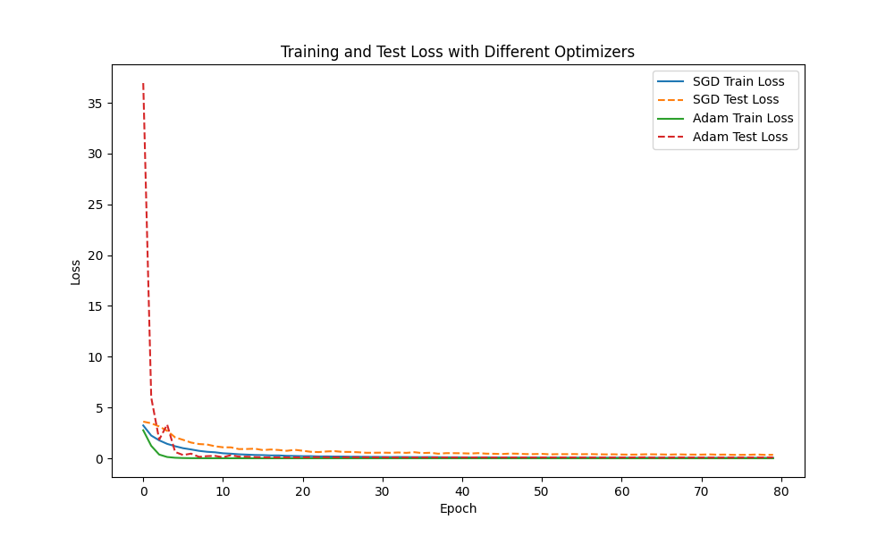
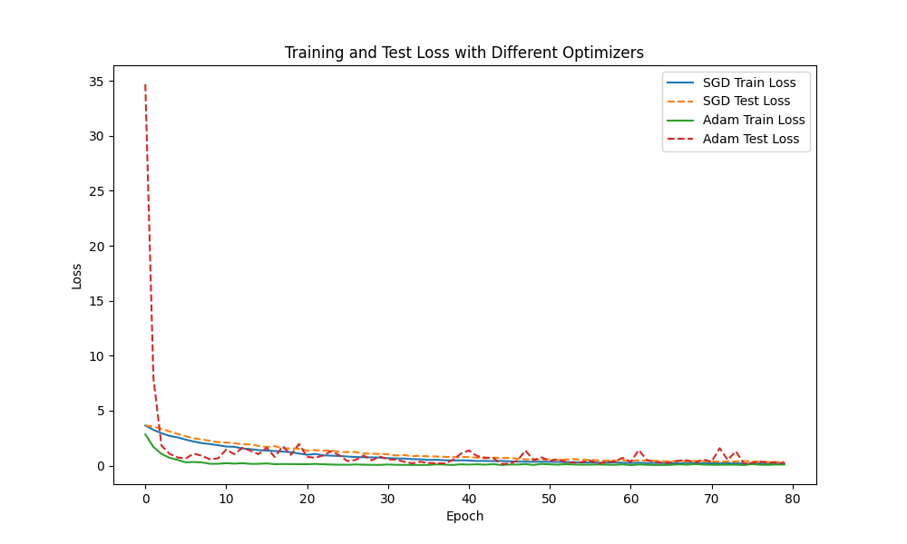
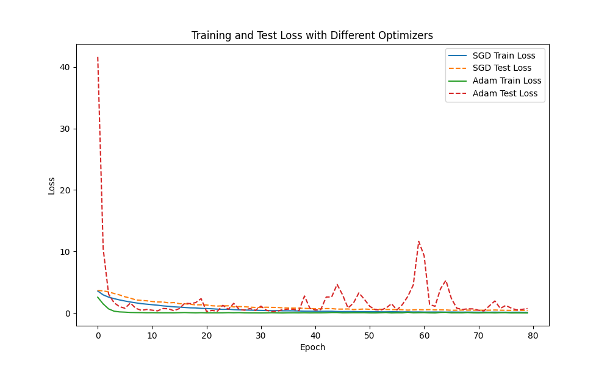
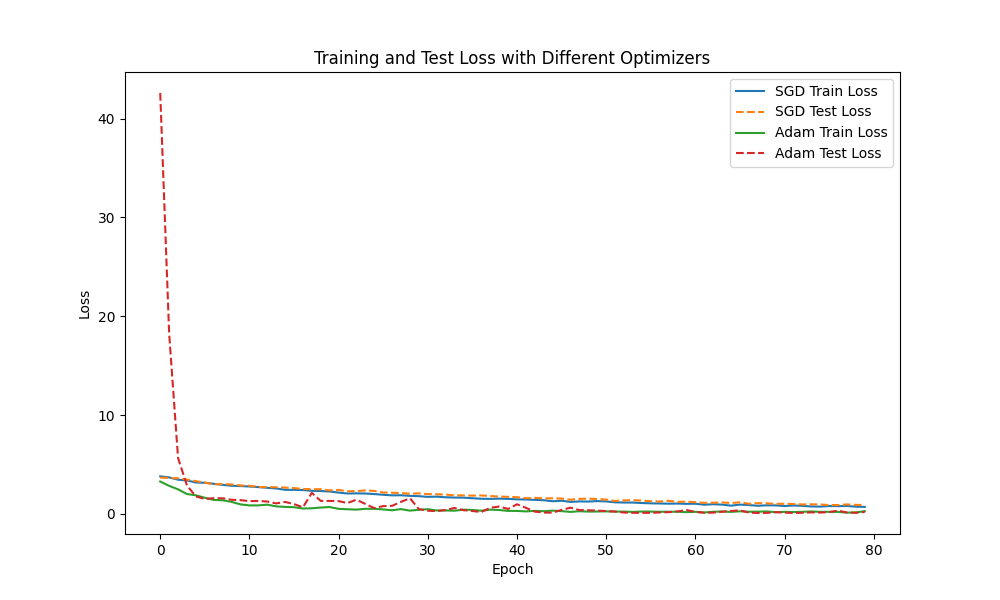
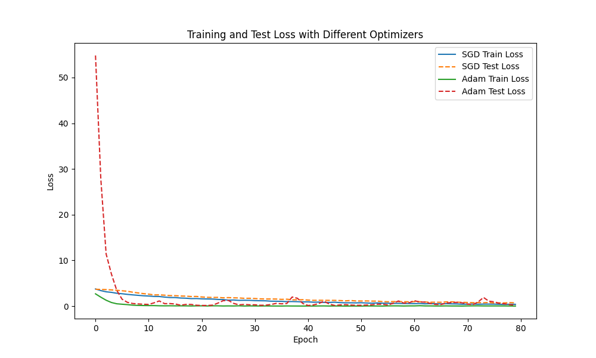

1️⃣【第四周作业】

1. 搭建的神经网络，使用olivettiface数据集进行训练。
2. 结合归一化和正则化来优化网络模型结构，观察对比loss结果。
3. 尝试不同optimizer对模型进行训练，观察对比loss结果。
4. 注册kaggle并尝试激活Accelerator，使用GPU加速模型训练。

2️⃣注意⚠️：前3个作业需要提交，第4个作业无需提交，自行完成。

### 对比1：采用正则化和不采用对损失结果的影响

####  无正则化Dropout运行结果
 

####  采用正则化Dropout运行结果

问题1：引入正则化是为了防止过拟合，p=0.5随机丢弃神经元的概率50%,epoch=80采用Adam优化器会出现过拟合是什么原因？GSD无影响
尝试引入L2 正则化weight_decay=0.0001、0.001效果更差？

### 对比2: 调整Dropout概率对损失结果的影响

#### Dropout概率为0.3的运行结果

#### Dropout概率为0.7的运行结果

结论：当Dropout概率增大0.2、0.5、0.7时，模型在训练集无变化，丢失概率越大泛化能力越强，测试集上的表现可能会变好。较高的Dropout概率可以有效防止过拟合。

### 对比3：DataLoader数据加载器batch_size参数对损失结果的影响

#### batch_size为32的运行结果

#### batch_size为64的运行结果

结论：p=0.5,epoch=80,lr=0.01,batchsize 16、32、64 样本数量增大，模型在训练集无变化，测试集表现变好，效果不大。

### 对比4：不同优化器对损失结果的影响
结论：GSD和Adam相比,后者收敛更快。前者训练集和测试集损失更稳定，学习率越小,预测更准备
