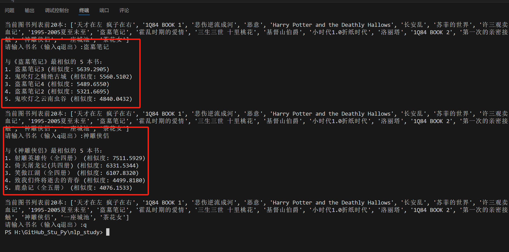
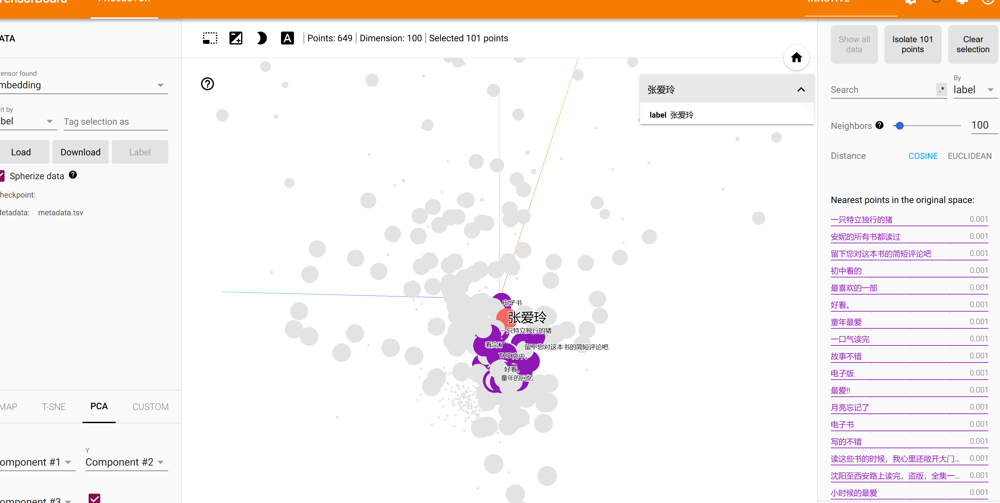

# 1【第五周作业】
1. 实现基于豆瓣top250图书评论的简单推荐系统（TF-IDF及BM25两种算法实现）
2. 使用自定义的文档文本，通过fasttext训练word2vec训练词向量模型，并计算词汇间的相关度。（选做：尝试tensorboard绘制词向量可视化图）
3. 使用课堂示例cooking.stackexchange.txt，使用fasttext训练文本分类模型。（选做：尝试使用Kaggle中的Fake News数据集训练文本分类模型）
https://www.kaggle.com/datasets/saurabhshahane/fake-news-classification

## 1 实现基于豆瓣top250图书评论的简单推荐系统（TF-IDF及BM25两种算法实现）

### TF 词频 (Term Frequency) 

### IDF 逆文档频率（Inverse Document Frequency, IDF）是一种衡量词语重要性的方法。它通过计算一个词语在所有文档中出现的稀有程度来降低常见词的权重，从而突出更具区分性的词语。

#### TF-IDF, 适合文本分类、关键词提取
- 算法本质：统计词频+逆文档频率 
- 词频处理：线程增长（高频词汇干扰）
- 计算复杂度：简单

#### BM25（Okapi BM25）,适合搜索引擎、问答系统
    是一种基于概率检索模型的文本匹配算法，用于信息检索和排序。它通过结合词频（TF）和逆文档频率（IDF），并引入文档长度的归一化处理，来衡量查询词与文档之间的相关性。BM25在实际应用中表现出较好的效果，尤其适用于搜索引擎和推荐系统。
- 算法本质：概率检索模型优化版
- 词频处理：非线性饱和（抑制重复此词影响）
- 计算复杂度：中等

## 2 使用自定义的文档文本，通过fasttext训练word2vec训练词向量模型，并计算词汇间的相关度。（选做：尝试tensorboard绘制词向量可视化图）

## 3 使用fasttext训练文本分类模型