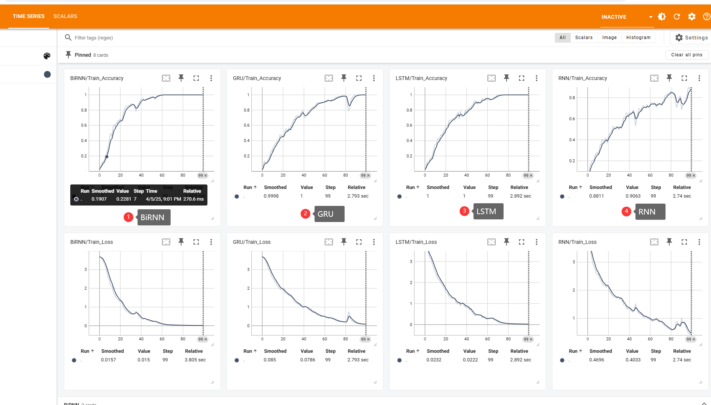
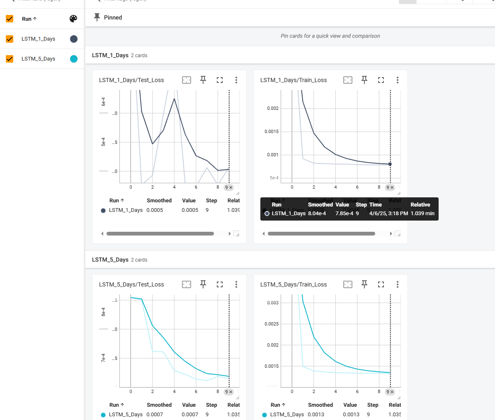
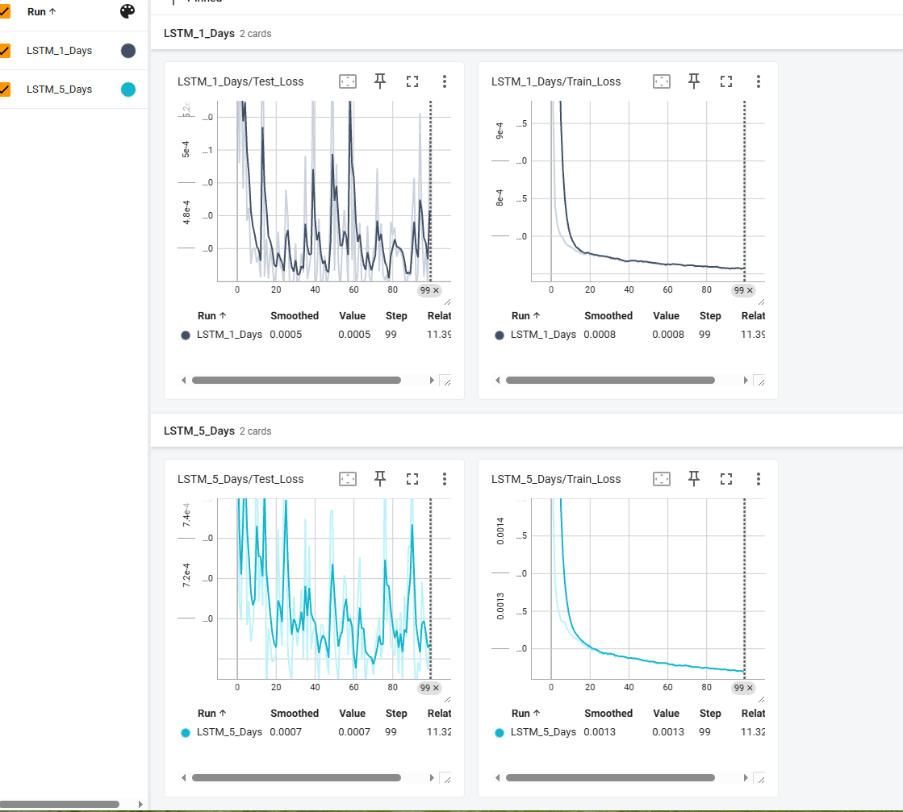

# ️【第六周作业】

1. 实验使用不同的RNN结构，实现一个人脸图像分类器。至少对比2种以上结构训练损失和准确率差异，如：LSTM、GRU、RNN、BiRNN等。要求使用tensorboard，提交代码及run目录和可视化截图。
https://scikit-learn.org/stable/modules/generated/sklearn.datasets.fetch_olivetti_faces.html

2. 使用RNN实现一个天气预测模型，能预测1天和连续5天的最高气温。要求使用tensorboard，提交代码及run目录和可视化截图。
数据集：URL_ADDRESS 数据集：https://www.kaggle.com/datasets/smid80/weatherww2

课堂代码示例：
rnn_code相关代码会更新到资料中。
kaggle代码：
https://www.kaggle.com/code/cliheng/fasttext-classification
https://www.kaggle.com/code/cliheng/rnn-timeseries-regression

## 作业1 不同的RNN结构实现一个人脸图像分类器
采用kaggle 52s · GPU P100运行结果：提交文件 `党金虎\week06\runs\events.out.tfevents.1743858084.5e2b96aebb28.17.0`

[不同的RNN结构实现一个人脸图像分类器 Kaggle代码地址](https://www.kaggle.com/code/zfy681/rnn-olivetti-test)

### 结论
- BiRNN：效果最好，准确率提高较快，损失下降迅速。

- GRU：稳定性较好，损失收敛较平稳。

- LSTM：性能好，但存在训练后期的波动，可能是 过拟合。

- RNN：性能较差，准确率和损失下降较慢，可能需要更高效的结构（如 LSTM 或 GRU）来优化表现。

## 作业2 RNN实现一个天气预测模型
[天气预测模型 Kaggle代码地址](https://www.kaggle.com/code/zfy681/rnn-weather-test)

