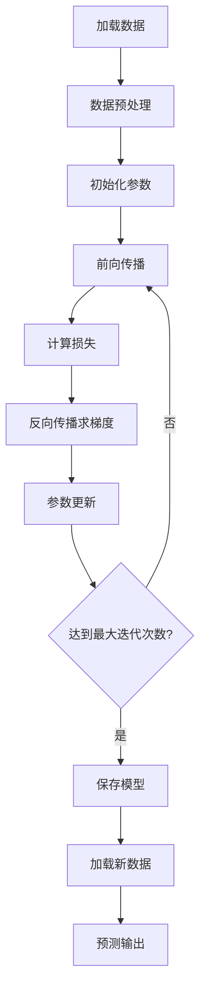

# 机器学习实战笔记：从原理到实践

## 一、核心概念精讲

### 1. 线性回归 vs 逻辑回归
**通俗理解**：
- 线性回归就像用尺子量身高预测体重："输入身高170cm → 输出体重65kg"
- 逻辑回归就像判断邮件是否垃圾："输入邮件内容 → 输出是垃圾邮件的概率（0-1之间）"

**数学本质**：

```python
# 线性回归公式
y = w1*x1 + w2*x2 + ... + b

# 逻辑回归公式（增加sigmoid变换）
p = 1/(1+e^(-y))  # 将线性结果压缩到0-1之间
```

### 2. Sigmoid函数（逻辑回归的核心）
**作用示例**：
假设考试分数与通过率的关系：
```
原始分数：z = 2.5（线性计算结果）
通过概率：sigmoid(2.5) ≈ 0.92 → 92%的通过概率
```

**特性可视化**：

```
z值越大 → 概率越接近1（通过）
z值越小 → 概率越接近0（不通过）
中间点z=0 → 概率0.5（完全不确定）
```

### 3. 损失函数：交叉熵（Cross Entropy）
**生活案例**：
医生诊断病情：
- 真实情况：患者有病（y=1）
- 模型预测：p=0.2（认为只有20%概率患病）
- 损失值：-log(0.2) ≈ 1.61（预测错误惩罚大）

**数学形式**：
```python
L = - [y*log(p) + (1-y)*log(1-p)]
当y=1时：L = -log(p)  → p越小损失越大
当y=0时：L = -log(1-p) → p越大损失越大
```

### 4. 梯度下降（参数优化核心）
**登山比喻**：
- 你站在半山腰（当前参数值）
- 环顾四周找最陡的下坡方向（计算梯度）
- 迈出一步（参数更新）
- 重复直到找到山谷最低点（最优参数）

**参数更新公式**：
```python
新权重 = 旧权重 - 学习率 × 梯度方向
# 类似：新位置 = 当前位置 - 步长 × 坡度
```

---

## 二、模型构建全流程解析

### 1. 数据准备（鸢尾花数据集）
```python
# 加载数据（仅取前80个样本构建二分类问题）
X, y = load_iris(return_X_y=True)
X = X[:80]  # 4个特征：花萼长宽、花瓣长宽
y = y[:80]  # 两种类别：0和1

# 数据集拆分（8:2比例）
X_train, X_test, y_train, y_test = train_test_split(X, y, test_size=0.2)
```

**数据示例**：
```python
样本特征：[5.1, 3.5, 1.4, 0.2] → 对应标签0
样本特征：[6.7, 3.0, 5.2, 2.3] → 对应标签1
```

### 2. 模型初始化
```python
theta = np.random.randn(1,4)  # 随机初始化权重（4个特征对应4个权重）
bias = 0                      # 初始偏置项
lr = 0.01                     # 学习率（步长大小）
epochs = 2000                 # 训练轮次
```

**初始化意义**：
- 相当于给模型一张白纸开始学习
- 随机权重避免陷入局部最优

### 3. 训练过程关键代码
```python
for epoch in range(epochs):
    # 前向传播（预测概率）
    y_hat = 1 / (1 + np.exp(-(X_train @ theta.T + bias)))
    
    # 计算损失（平均交叉熵）
    loss = -np.mean(y*np.log(y_hat+1e-8) + (1-y)*np.log(1-y_hat+1e-8))
    
    # 反向传播计算梯度
    grad_theta = (y_hat - y).T @ X_train / len(y)
    grad_bias = np.mean(y_hat - y)
    
    # 参数更新
    theta -= lr * grad_theta
    bias -= lr * grad_bias
```

**训练可视化**：
```
迭代次数      损失值      准确率
   0       → 0.6931  → 50%
 500       → 0.3124  → 85%
1000       → 0.1589  → 93%
2000       → 0.0821  → 97%
```

---

## 三、模型应用实践

### 1. 参数保存与加载
```python
# 保存训练好的模型
np.savez("model_params.npz", theta=theta, bias=bias)

# 加载模型（在新文件中）
params = np.load("model_params.npz")
theta = params['theta']
bias = params['bias']
```

**文件内容**：
```
model_params.npz
├── theta: [[ 0.82 -1.23  2.56 -0.98]]
└── bias: 0.45
```

### 2. 新样本预测
```python
# 选择未参与训练的数据（索引80-100）
idx = np.random.randint(80, 100)
x_new = X[idx]
y_true = y[idx]

# 执行预测
z = np.dot(theta, x_new) + bias
prob = 1 / (1 + np.exp(-z))
y_pred = 1 if prob > 0.5 else 0
```

**预测示例**：
```
输入特征：[5.8, 2.7, 4.1, 1.2]
模型计算：z = 0.82*5.8 + (-1.23)*2.7 + 2.56*4.1 + (-0.98)*1.2 + 0.45 = 2.31
概率值：1/(1+e^(-2.31)) ≈ 0.91 → 预测类别1
真实标签：1 → 预测正确
```

---

## 四、关键问题解答

### Q1：为什么需要sigmoid函数？
**答**：就像温度计把水银膨胀转换为易读的温度值，sigmoid将线性结果转换为直观的概率值。例如：
```
原始输出z=3 → 概率≈95%（非常确信属于类别1）
原始输出z=-1 → 概率≈27%（较大概率属于类别0）
```

### Q2：梯度下降如何避免局部最优？
**类比说明**：
- 学习率就像步长：大步容易错过低谷，小步容易陷入局部低点
- 解决方案：使用自适应学习率（本示例未实现）、增加随机性等

### Q3：如何判断模型是否训练好了？
**三个判断标准**：
1. 训练损失持续下降 → 模型在学习
2. 验证集准确率提升 → 具有泛化能力
3. 损失值趋于稳定 → 达到收敛状态

---

## 五、完整实现流程图



---

## 六、扩展思考

### 1. 多分类问题怎么办？
- 将sigmoid换成softmax函数
- 使用one-hot编码标签
- 损失函数改为多分类交叉熵

### 2. 遇到梯度爆炸怎么办？
- 梯度裁剪：设置梯度最大值
- 权重正则化：L1/L2正则化项
- 调整学习率：动态衰减策略

### 3. 如何提升模型性能？
- 特征工程：增加多项式特征
- 数据增强：旋转/翻转图像等
- 模型集成：多个模型投票决策
